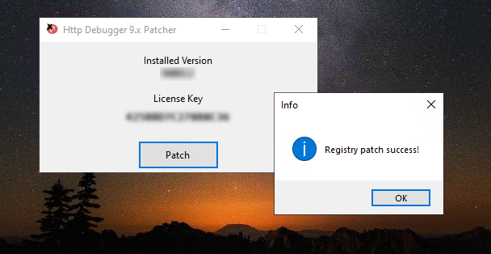

  

## HTTPDebuggerPatcher
Another **HTTP Debugger** 9.x version Patcher + Keygen.

## How to:
+ Download the latest release
+ Run it and press "Patch", retry if it doesn't succeed from the first time

> [!IMPORTANT]
> Consider buying the real Http Debugger Pro subscription because this patch isn't an indefinite solution for the registry entry (it gets updated after a while which causes the app to ask for a valid subscription).
